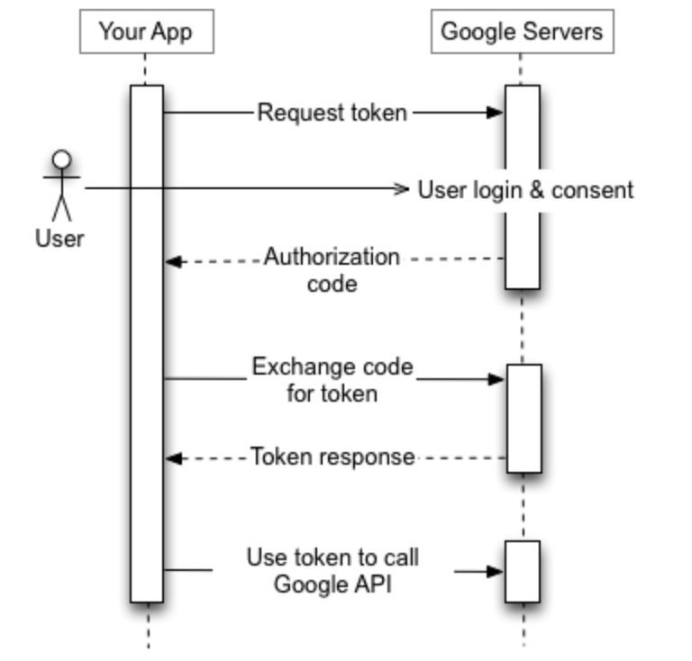

## 우선 정리만 해두는 공간 

### Spring 웹 계층
- Web Layer
  - 흔히 사용하는 컨트롤러(@Controller)와 JSP/Freemarker 등의 뷰 템플릿 영역

- Service Layer
  - @Service에 사용되는 서비스 영역
  - Transactional이 사용되어야 하는 영역
- Repository Layer
  - Database와 같이 데이터 저장소에 접근하는 영역 (= DAO 영역)

- Dtos
  - DTO(Data Transfer Object)들의 영역을 말함
  
- Domain Model
 - 도메인이라 불리는 개발 대상을 모든 사람이 동일한 관점에서 이해할 수 잇고 공유할 수 있도록 단순화 시킨 것

- @MappedSuperclass
  - JPA Entity 클래스들이 BaaseTimeEntity를 상속할 경우 필드들도 칼럼으로 인식하도록함.

- @EntityListeners(AuditingEntityListener.clas)
  - BaseTimeEntity 클래스에 Auditing 기능을 포함시킴.


### OAuth(Open Authorization)
- 인터넷 사용자들이 비밀번호를 제공하지 않고 다른 웹사이트 상의 자신들의 정보에 대해 웹사이트나 애플리케이션의 접근 권한을 부여할 수 있는 공통적인 수단으로서 사용되는, 접근 위임을 위한 개방형 표준이다.
- 페이스북, 구글, 카카오 등에서 제공하는 인증 서비스를 사용하여 인증을 수행

#### Google OAuth
- [api-client-library](https://developers.google.com/api-client-library/java/google-oauth-java-client/oauth2?hl=ko)




### 세션 저장소
- 세션 저장소는 세션을 저장하는 저장소를 말한다.
- 실제 현업에서는 다음 3가지 중 한가지를 선택해 사용한다.
- application.properties에 설정
- 
```properties
spring.session.store-type=jdbc // DB 세션 저장소 사용
```


#### 1. 톰캣 세션
  - 별다른 설정을 하지 않을 때 기본적으로 사용하는 세션 저장소
  - 톰캣 메모리에 저장되기 떄문에 톰캣이 재시작되면 세션 정보가 날아감
  - 2대 이상의 WAS가 구동되는 환경에서는 톰캣 간의 세션 공유를 위한 추가 설정이 필요

#### 2. 데이터베이스 세션
  - 세션을 데이터베이스에 저장
  - 세션을 DB에 저장하므로 톰캣 재시작해도 세션 유지
  - 여러 WAS에 걸쳐 세션을 공유할 수 있음
  - 로그인 요청마다 DB IO가 발생하므로 성능 저하의 우려가 있음
  - 사용시 의존성 추가 필요
```Gradle
implementation 'org.springframework.session:spring-session-jdbc'
```
#### 3. Redis 세션
  - 세션을 Redis에 저장하므로 톰캣 재시작해도 세션 유지7
  - 여러 WAS에 걸쳐 세션을 공유할 수 있음
  - Redis는 메모리 DB이므로 세션 저장에는 최적화되어 있음
  - B2C에서 가장 많이 사용하는 방식

